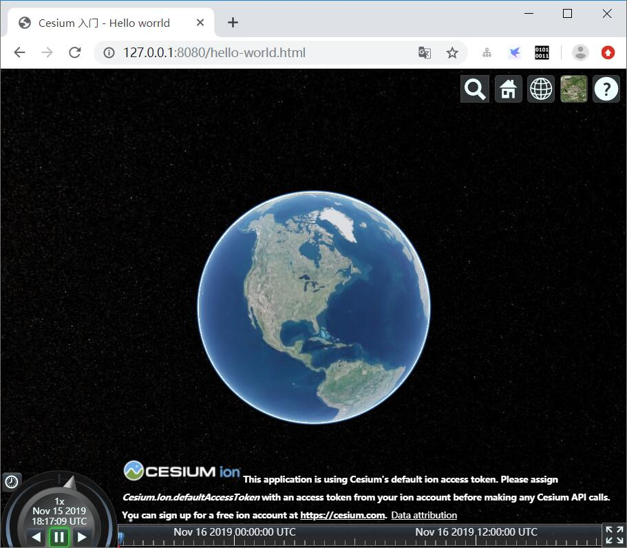

# 第一个cesium应用-Hello world

前面已经下载了cesium依赖，存放在 `node_modules` 目录下，本地运行没任何问题，在上传github加载时似乎对于`node_modules`有隔阂，重命名为`libs`，如果你是手动下载的cesium源码或release包则不会有这样的问题。

现在我们实现第一个cesium应用-Hello world。

新建一个`hello-world.html`:

``` html
<!DOCTYPE html>
<html lang="en">
<head>
    <meta charset="UTF-8">
    <meta name="viewport" content="width=device-width, initial-scale=1.0">
    <meta http-equiv="X-UA-Compatible" content="ie=edge">
    <title>Cesium 入门 - Hello worrld</title>
</head>
<body>
    
</body>
</html>
```

引入cesium组件样式：

```html
<style>
    @import url(libs/cesium/Build/CesiumUnminified/Widgets/widgets.css);
    html,
    body {
        height: 100%;
        margin: 0;
        padding: 0;
    }
</style>
```

`body`标签中新建一个`div`,设置其id为`cesiumContainer`，并引入`cesium.js`:

``` html
<div id="cesiumContainer" style="height: 100%;"></div>
<script src="libs/cesium/Build/CesiumUnminified/Cesium.js"></script>
```

下面就准备写下我们第一行cesium代码：

``` html
<script>
        var viewer = new Cesium.Viewer("cesiumContainer");
</script>
```

[完整代码](https://github.com/Sogrey/Cesium-start-Example/blob/master/hello-world.html)

先预览一下吧：



[在线预览](https://sogrey.github.io/Cesium-start-Example/hello-world.html)

一个圆润的地球映入眼帘，到此第一个应用就完成了。

