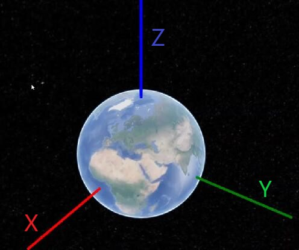

# cesium 坐标系统

## WGS84坐标系 和 笛卡尔空间Cartesian3直角坐标系

- [WGS84](https://baike.baidu.com/item/WGS84/4380144?fr=aladdin)坐标系
- 笛卡尔空间([Cartesian3](https://cesium.com/docs/cesiumjs-ref-doc/Cartesian3.html))直角坐标系

> 地球仪长半轴：6378137.0米

- [Cartographic](https://cesium.com/docs/cesiumjs-ref-doc/Cartographic.html) 制图坐标（longitude，latitude，height），对应经纬度坐标，弧度制，主要用在用户接口上。方便理解、直观。
- [Cartesian2](https://cesium.com/docs/cesiumjs-ref-doc/Cartesian2.html) 平面坐标系
- [Cartesian3](https://cesium.com/docs/cesiumjs-ref-doc/Cartesian3.html) 笛卡尔直角坐标系（x,y,z）做空间计算用
- [Cartesian4](https://cesium.com/docs/cesiumjs-ref-doc/Cartesian4.html) 几乎用不到



笛卡尔空间坐标的原点就是椭球的中心。单位米。

Cesium的坐标是以地心为原点，一向指向南美洲(X 经度0)，一向指向亚洲(Y)，一向指向北极州(Z)

- 从经纬度经`fromDegrees`函数转换成[Cartesian3](https://cesium.com/docs/cesiumjs-ref-doc/Cartesian3.html?classFilter=Cartesian3)世界坐标。

  fromDegrees()方法，将经纬度和高程转换为世界坐标
  
  ``` js
  Cesium.Cartesian3.fromDegrees(-117.16, 32.71,   15000.0)
  //等同于
  //new Cesium.Cartesian3(-2457919.937615054, -4790818.832832404,3435047.293539871)
  ```

- 直接new Cartesian3：

  ``` js
  new Cesium.Cartesian3(-2457919.937615054, -4790818.832832404,3435047.293539871)
  ```


## 坐标转换

构造定义：

1. Cartesian2 ： new Cesium.Cartesian2(x, y)
2. Cartesian3 ：  new Cesium.Cartesian3(x, y, z）
3. Cartographic： new Cesium.Cartographic(longitude, latitude, height) 注：经纬度为弧度单位

### 角度与弧度转换

``` js
/**
 * 弧度转角度
 */
function radian2Angle(radian) {
    // 角度 = 弧度 * 180 / Math.PI;
    return radian * 180 / Math.PI;
}
/**
 * 角度转弧度
 */
function angle2Radian(angle) {
    // 弧度= 角度 * Math.PI / 180;
    return angle * Math.PI / 180;
}
```

### 获取鼠标点在屏幕中的坐标

``` js
// 获取画布
var canvas = viewer.scene.canvas;

var mouseHander = new Cesium.ScreenSpaceEventHandler(canvas);

// 绑定鼠标左点击事件
mouseHander.setInputAction(function (event){
	// 获取鼠标点的windowPosition
	var windowPosition = event.position;
}, Cesium.ScreenSpaceEventType.LEFT_CLICK);)
```

### 屏幕坐标转换为笛卡尔空间直角坐标

``` js
var ray = viewer.camera.getPickRay(windowPosition);

var cartesian3 = viewer.scene.globe.pick(ray, viewer.scene);
```

### 三维笛卡尔空间直角坐标转换为地理坐标(弧度)

``` js
var ellipsoid=viewer.scene.globe.ellipsoid;

var cartographic=ellipsoid.cartesianToCartographic(cartesian);
```

### 三维笛卡尔空间直角坐标转换为地理坐标(经纬度)

``` js
var ellipsoid=viewer.scene.globe.ellipsoid;

var cartographic=ellipsoid.cartesianToCartographic(cartesian);

var lat=Cesium.Math.toDegrees(cartographic.latitude);
var lng=Cesium.Math.toDegrees(cartographic.longitude);
var alt=cartographic.height;
```

### 经纬度转换为笛卡尔空间直角坐标

直接转
``` js
# Cesium.Cartesian3.fromDegrees(longitude, latitude, height, ellipsoid, result)
var position = Cesium.Cartesian3.fromDegrees(-115.0, 37.0);
```
先转换为弧度，再进行转换
``` js
var ellipsoid=viewer.scene.globe.ellipsoid;
var cartographic=Cesium.Cartographic.fromDegrees(lng, lat, alt);
var cartesian = ellipsoid.cartographicToCartesian(cartographic);
```

### 笛卡尔空间直角坐标转换为屏幕坐标

``` js
var pick = Cesium.SceneTransforms.wgs84ToWindowCoordinates(viewer.scene, cartesian);
```

### 三维笛卡尔坐标转换为二维笛卡尔坐标

``` js
Cesium.Cartesian2.fromCartesian3(cartesian, result)
```

### 弧度与经纬度的相互转换

经纬度转换为弧度

``` js
Cesium.CesiumMath.toRadians(degrees) 
```

弧度转换为经纬度

``` js
Cesium.CesiumMath.toDegrees(radians)
```
---

大体总结：`Cartographic`与`Cartesian3`、`Cartesian2`、`经纬度坐标（WGS84）`坐标转换：

- Cartographic → Cartesian3 : [Cartographic.toCartesian](https://cesium.com/docs/cesiumjs-ref-doc/Cartographic.html#.toCartesian)   
- Cartesian3   → Cartographic : [Cesium.Cartographic.fromCartesian(cartesian, ellipsoid, result)](https://cesium.com/docs/cesiumjs-ref-doc/Cartographic.html#.fromCartesian) 
- Cartesian3→ Cartesian2:　[Cesium.Cartesian2.fromCartesian3(cartesian, result)](https://cesium.com/docs/cesiumjs-ref-doc/Cartesian2.html#.fromCartesian3)
- 经纬度坐标（WGS84）→ Cartesian3:[Cesium.Cartesian3.fromDegrees(longitude, latitude, height, ellipsoid, result)](https://cesium.com/docs/cesiumjs-ref-doc/Cartesian3.html#.fromDegrees)
- 弧度坐标 → Cartesian3:[Cesium.Cartesian3.fromRadians(longitude, latitude, height, ellipsoid, result)](https://cesium.com/docs/cesiumjs-ref-doc/Cartesian3.html#.fromRadians)
- 经纬度坐标（WGS84）→ Cartographic:[Cesium.Cartographic.fromDegrees(longitude, latitude, height, result)](https://cesium.com/docs/cesiumjs-ref-doc/Cartographic.html#.fromDegrees)

Cartesian3一些常用API:

- [Cartesian3.clone](https://cesium.com/docs/cesiumjs-ref-doc/Cartesian3.html#.clone)
  复制Cartesian3实例。
- [Cartesian3.distance](https://cesium.com/docs/cesiumjs-ref-doc/Cartesian3.html#.distance)
  计算两点之间的距离。
- [Cartesian3.dot](https://cesium.com/docs/cesiumjs-ref-doc/Cartesian3.html#.dot)
  计算两个笛卡尔的点（标量）乘积。
- [Cartesian3.cross](https://cesium.com/docs/cesiumjs-ref-doc/Cartesian3.html#.cross)
  计算两个笛卡尔的叉（外）乘积。
- [Cartesian3.normalize](https://cesium.com/docs/cesiumjs-ref-doc/Cartesian3.html#.normalize)
  计算提供的笛卡尔坐标系的标准化形式，归一化

> 注意传入参数末尾参数result，为了优化内存使用，传入result，计算后结果赋值给该result，可复用，不传则会创建一个result。


## 参考

- [关于Cesium中的常用坐标系及说明](https://blog.csdn.net/XLSMN/article/details/76168510)
- [Cesium中的坐标的转化](https://blog.csdn.net/caozl1132/article/details/86220824)
- [Cesium中的几种坐标和相互转换](https://blog.csdn.net/qq_34149805/article/details/78393540)
- [Cesium.Cartesian3 和经纬度以及屏幕坐标等之间的转换](https://blog.csdn.net/u013821237/article/details/80169327)


  

