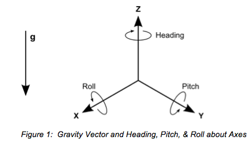
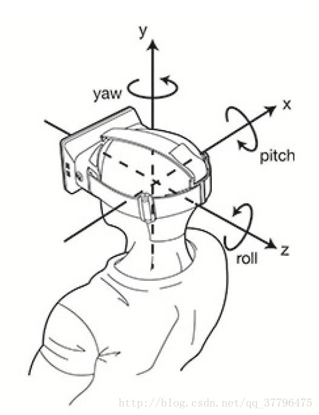
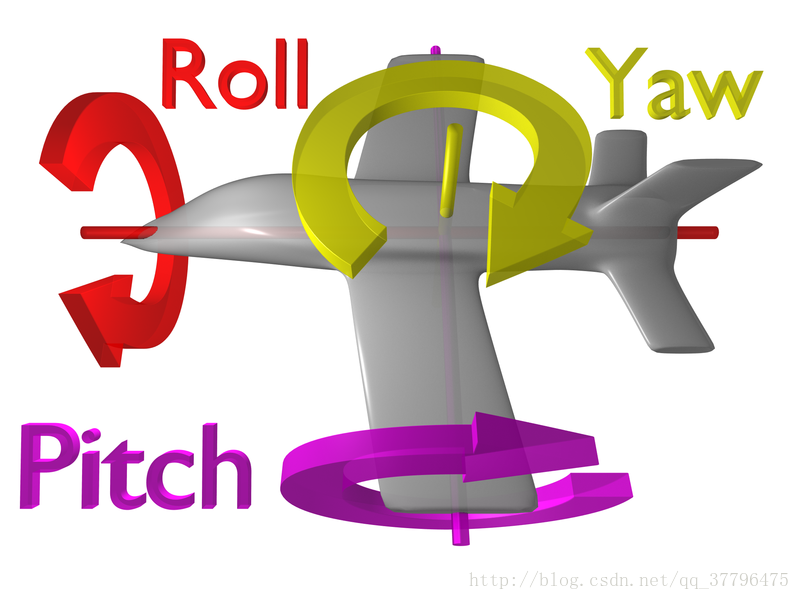

# Camera 相机及视角

## Camera类-去哪儿，随心所欲

cesium中的相机：

`Cesium.Viewer.camera`:[Camera](https://cesium.com/docs/cesiumjs-ref-doc/Camera.html)

Camera常用属性：

- [position](https://cesium.com/docs/cesiumjs-ref-doc/Camera.html#position) 相机在世界坐标中的位置，[direction](https://cesium.com/docs/cesiumjs-ref-doc/Camera.html#direction) 相机的观看方向，[right](https://cesium.com/docs/cesiumjs-ref-doc/Camera.html#right) 相机的朝右方向？[up](https://cesium.com/docs/cesiumjs-ref-doc/Camera.html#up) 相机的向上方向？

  

- [heading](https://cesium.com/docs/cesiumjs-ref-doc/Camera.html#heading)(朝向)、[pith](https://cesium.com/docs/cesiumjs-ref-doc/Camera.html#pitch)(俯仰) 、 [roll](https://cesium.com/docs/cesiumjs-ref-doc/Camera.html#roll)(翻滚)

  
  
  图中`g`是重力方向与`Z`相反。

  相对于物体（飞机自身）的旋转角度。

  面朝正东向：heading=0;pith=0;
 
  朝向（heading）：东面正向,左右摆,左负右正

  俯仰（pith）：上下摆,上正下负
  
  盗个图：
  
  
  
  
  盗图选自[@installing](https://blog.csdn.net/qq_37796475)：[Cesium类HeadingPitchRoll及heading、pitch、roll等参数详解](https://blog.csdn.net/qq_37796475/article/details/79188477)


Camera有几个常用API：

- [setView(options)](https://cesium.com/docs/cesiumjs-ref-doc/Camera.html#setView) Sets the camera position, orientation and transform. 设置相机的位置、方向和变换。
- [flyTo(options)](https://cesium.com/docs/cesiumjs-ref-doc/Camera.html#flyTo) Flies the camera from its current position to a new position. 使相机从当前位置飞到新位置。
- [HeadingPitchRange(heading, pitch, range) ](https://cesium.com/docs/cesiumjs-ref-doc/HeadingPitchRange.html)
- [lookAt(target, offset)](https://cesium.com/docs/cesiumjs-ref-doc/Camera.html#lookAt)

## setView(options)

官方示例：

``` js
// 1. Set position with a top-down view 设置相机位置
viewer.camera.setView({
    destination : Cesium.Cartesian3.fromDegrees(-117.16, 32.71, 15000.0)
});

// 2 Set view with heading, pitch and roll
viewer.camera.setView({
    destination : cartesianPosition,
    orientation: {
        heading : Cesium.Math.toRadians(90.0), // east, default value is 0.0 (north) 左右摆头
        pitch : Cesium.Math.toRadians(-90),    // default value (looking down) 上下抬头
        roll : 0.0                             // default value
    }
});

// 3. Change heading, pitch and roll with the camera position remaining the same.
viewer.camera.setView({
    orientation: {
        heading : Cesium.Math.toRadians(90.0), // east, default value is 0.0 (north)
        pitch : Cesium.Math.toRadians(-90),    // default value (looking down)
        roll : 0.0                             // default value
    }
});


// 4. View rectangle with a top-down view
viewer.camera.setView({
    destination : Cesium.Rectangle.fromDegrees(west, south, east, north)
});

// 5. Set position with an orientation using unit vectors.
viewer.camera.setView({
    destination : Cesium.Cartesian3.fromDegrees(-122.19, 46.25, 5000.0),
    orientation : {
        direction : new Cesium.Cartesian3(-0.04231243104240401, -0.20123236049443421, -0.97862924300734),
        up : new Cesium.Cartesian3(-0.47934589305293746, -0.8553216253114552, 0.1966022179118339)
    }
});
```
查看北京城：

``` js
viewer.camera.setView({
    destination: Cesium.Cartesian3.fromDegrees(116.39, 39.9, 15000.0),
    orientation: {
        heading: Cesium.Math.toRadians(0.0), // east, default value is 0.0 (north)
        pitch: Cesium.Math.toRadians(-90), // default value (looking down)
        roll: 0.0 // default value
    }
});
```
## setView 之 rectangle 方式
设置目标为一个矩形区域:
``` js
view.camera.setView({
    destination: Cesium.Rectangle.fromDegrees(0.0,20.0,10.0,30.0),//west, south, east, north
    orientation: {
        heading : Cesium.Math.toRadians(20.0), // 方向
        pitch : Cesium.Math.toRadians(-90.0),// 倾斜角度
        roll : 0
    }
});
```
定位到范围参考[这里](https://blog.csdn.net/sunj92/article/details/87694110#2%E3%80%81%E5%AE%9A%E4%BD%8D%E5%88%B0%E8%8C%83%E5%9B%B4) [内链](other/03-pick.html#获取相机视野范围):
``` js
//视野范围
var re = viewer.camera.computeViewRectangle();
//返回 re=Rectangle {
//         west: 1.900335469218777,
//         south: 0.5968981529134573,
//         east: 1.900355394617851,
//         north: 0.5969145303070917}

//计算经纬度
var lon = (re. west/ Math.PI * 180+re.east/ Math.PI * 180)/2;
var lat = (re.north/ Math.PI * 180+re.south/ Math.PI * 180)/2;
console.log(lon,lat);
```
## flyTo(options)

官方示例：

``` js
// 1. Fly to a position with a top-down view
viewer.camera.flyTo({
    destination : Cesium.Cartesian3.fromDegrees(-117.16, 32.71, 15000.0)
});

// 2. Fly to a Rectangle with a top-down view
viewer.camera.flyTo({
    destination : Cesium.Rectangle.fromDegrees(west, south, east, north)
});

// 3. Fly to a position with an orientation using unit vectors.
viewer.camera.flyTo({
    destination : Cesium.Cartesian3.fromDegrees(-122.19, 46.25, 5000.0),
    orientation : {
        direction : new Cesium.Cartesian3(-0.04231243104240401, -0.20123236049443421, -0.97862924300734),
        up : new Cesium.Cartesian3(-0.47934589305293746, -0.8553216253114552, 0.1966022179118339)
    }
});

// 4. Fly to a position with an orientation using heading, pitch and roll.
viewer.camera.flyTo({
    destination : Cesium.Cartesian3.fromDegrees(-122.19, 46.25, 5000.0),
    orientation : {
        heading : Cesium.Math.toRadians(175.0),
        pitch : Cesium.Math.toRadians(-35.0),
        roll : 0.0
    }
});
```

查看北京城：

``` js
viewer.camera.flyTo({
    destination: Cesium.Cartesian3.fromDegrees(116.39, 39.9, 15000.0),
    orientation: {
        heading: Cesium.Math.toRadians(0.0), // east, default value is 0.0 (north)
        pitch: Cesium.Math.toRadians(-90), // default value (looking down)
        roll: 0.0 // default value
    }
});
```
## HeadingPitchRange(heading, pitch, range)
在局部框架中定义`航向角`，`俯仰角`和`范围`。

- 航向是从局部北向旋转，其中正角向东增加。间距是从局部xy平面旋转的角度。
- 正俯仰角在平面上方。负俯仰角在平面下方。
- 范围是距框架中心的距离。

参数：

- `heading`	 航向角，以弧度为单位。航向方向的右侧为正
- `pitch`	 俯仰角（以弧度为单位）。仰为正，俯为负
- `range`	 距中心的距离，以米为单位。

Using a HeadingPitchRange offset
``` js
var center = Cesium.Cartesian3.fromDegrees(116.39, 39.9);
var heading = Cesium.Math.toRadians(50.0);
var pitch = Cesium.Math.toRadians(-20.0);
var range = 5000.0;
viewer.camera.lookAt(center, new Cesium.HeadingPitchRange(heading, pitch, range));
```

## lookAt(target, offset)
使用`目标`和`偏移量`设置摄像机的`位置`和`方向`。
目标**必须以世界坐标给出**。
偏移可以是`笛卡尔坐标系`，也可以是以目标为中心的局部北北向上参考系中的`航向`/`俯仰`/`范围`。

如果偏移量是笛卡尔坐标，则它是相对于转换矩阵定义的参考帧中心的偏移量。

如果偏移为航向/俯仰/范围，则航向和俯仰角在变换矩阵定义的参考帧中定义。

航向是从y轴到x轴的角度。间距是从xy平面开始的旋转。

正俯仰角在平面下方。负俯仰角在平面上方。范围是距中心的距离。

在2D模式下，必须有一个俯视图。摄像机将被放置在目标上方并向下看。目标上方的高度将是`偏移量`。
航向将根据偏移量确定。如果无法从偏移量确定航向，则航向将为北。

- `target`	世界坐标中的目标位置。
- `offset`	`Cartestian3`在局部东北向上参考系中与目标的偏移，以目标为中心;或`HeadingPitchRange` 航向仰俯角距离。

Using a cartesian offset
``` js
var center = Cesium.Cartesian3.fromDegrees(116.39, 39.9);
viewer.camera.lookAt(center, new Cesium.Cartesian3(0.0, -4790000.0, 3930000.0));
```

``` js
var center = Cesium.Cartesian3.fromDegrees(-72.0, 40.0);//目标点
var heading = Cesium.Math.toRadians(50.0);//航向角
var pitch = Cesium.Math.toRadians(-20.0);//仰俯角
var range = 5000.0;//距离
view.camera.lookAt(center, new Cesium.HeadingPitchRange(heading, pitch, range));
```

> lookAt会将视角固定在设置的点上

[在线预览](https://sogrey.github.io/Cesium-start-Example/examples/camera/view-beijing.html)

## 记录视角

同理，想要标记某个位置和角度，下次直接进入，可以在选好的角度上按<a href="#记录视角" class="btn-gradient red mini">F12</a>进入开发者工具输入

- `viewer.camera.heading`
-  `viewer.camera.pitch` 
-  `viewer.camera.position`

回车可以得到信息,**获取到的是弧度**,[角度与弧度转换](03-coordinate-system.html#%E8%A7%92%E5%BA%A6%E4%B8%8E%E5%BC%A7%E5%BA%A6%E8%BD%AC%E6%8D%A2)

``` js
//获取视角
function getCamera() {
    return {
        position: viewer.camera.position,
        heading: viewer.camera.heading,
        pitch: viewer.camera.pitch
    }
}
```

``` js
//设置视角
viewer.camera.flyTo({
    destination: getCamera().position,
    orientation: {
        heading: getCamera().heading, // east, default value is 0.0 (north)
        pitch: getCamera().pitch, // default value (looking down)
        roll: 0.0 // default value
    }
});
```

[在线预览-查看北京城](https://sogrey.github.io/Cesium-start-Example/examples/camera/view-beijing.html)
[在线预览-地球自转](https://sogrey.github.io/Cesium-start-Example/examples/camera/earth-rotation.html)

## 设置默认视角

cesium默认视角定位在美国，也就是点击`HomeButton`转向的视角，怎么修改默认视角呢？

需要在**创建`Viewer`之前**执行下面代码：

``` js
//设置默认视角在中国
var china = Cesium.Rectangle.fromDegrees(100,10,120,70);
Cesium.Camera.DEFAULT_VIEW_RECTANGLE = china;

var viewer  = new Cesium.Viewer("cesiumdiv");
```

## Cartesian3和Cartographic

- [Cartographic](https://cesium.com/docs/cesiumjs-ref-doc/Cartographic.html) 制图坐标（longitude，latitude，height），对应经纬度坐标，弧度制，主要用在用户接口上。方便理解、直观。
- [Cartesian3](https://cesium.com/docs/cesiumjs-ref-doc/Cartesian3.html) 笛卡尔直角坐标系（x,y,z）做空间计算用

坐标转换：

- Cartographic -> Cartesian3 : [Cartographic.toCartesian](https://cesium.com/docs/cesiumjs-ref-doc/Cartographic.html#.toCartesian)  
- Cartesian3   -> Cartographic : [Cartographic.fromCartesian](https://cesium.com/docs/cesiumjs-ref-doc/Cartographic.html#.fromCartesian)  

Cartesian3一些常用API:

- [Cartesian3.clone](https://cesium.com/docs/cesiumjs-ref-doc/Cartesian3.html#.clone)   复制Cartesian3实例。
- [Cartesian3.distance](https://cesium.com/docs/cesiumjs-ref-doc/Cartesian3.html#.distance)   计算两点之间的距离。
- [Cartesian3.dot](https://cesium.com/docs/cesiumjs-ref-doc/Cartesian3.html#.dot)  计算两个笛卡尔的点（标量）乘积。
- [Cartesian3.cross](https://cesium.com/docs/cesiumjs-ref-doc/Cartesian3.html#.cross)  计算两个笛卡尔的叉（外）乘积。
- [Cartesian3.normalize](https://cesium.com/docs/cesiumjs-ref-doc/Cartesian3.html#.normalize) 笛卡尔标准化，归一化

## 获取相机朝向在水平面上的投影的方向

应用场景：做第一人称漫游时，调整相机方向朝向地下，前进[camera.moveForward](https://cesium.com/docs/cesiumjs-ref-doc/Camera.html#moveForward)
和后退[camera.moveBackward](https://cesium.com/docs/cesiumjs-ref-doc/Camera.html#moveBackward)时出现上天入地的情况，为模拟人物在水平面行走，
这种情况是不允许的，不论相机朝天朝地都应该在水平面平行方向运动。

由[camera.lookUp](https://cesium.com/docs/cesiumjs-ref-doc/Camera.html#lookUp)的源码有感而发。
``` js
var pitch = viewer.camera.pitch;
viewer.camera.look(viewer.camera.right,pitch);//调整相机朝向水平
//相机朝向在水平面上的投影的方向
console.log(viewer.camera.direction.clone());
viewer.camera.look(viewer.camera.right,-pitch);//恢复相机朝向为之前的方向
```
参照`camera.look`方法：
``` js
/**
 * 获取相机水平面上投影朝向
 * @param {Cesium.Camera} camera 相机
 * @param {Cesium.Cartesian3} result [可选]相机水平面上投影朝向,（已转为单位向量）
 */
function getHorizontalDirection(camera, result) {    
    if (!Cesium.defined(camera)) {
        console.error("camera must not be null.");
        return null;
    }

    if (!Cesium.defined(result)) {
        result = new Cesium.Cartesian3();
    }
    
    var direction = camera.direction.clone();
    var position = camera.position.clone();
    var pitch = camera.pitch;
    var right =camera.right.clone();   

    var lookScratchQuaternion = new Cesium.Quaternion();
    var lookScratchMatrix = new Cesium.Matrix3();

    var turnAngle = Cesium.defined(pitch)?pitch:camera.defaultLookAmount;
    var quaternion = Cesium.Quaternion.fromAxisAngle(right, -turnAngle, lookScratchQuaternion);
    var rotation = Cesium.Matrix3.fromQuaternion(quaternion, lookScratchMatrix);

    Cesium.Matrix3.multiplyByVector(rotation, direction, result);

    Cesium.Cartesian3.normalize(result, result);

    return result;
}
```

查看[示例](https://sogrey.github.io/Cesium-start-Example/examples/camera/first-person-roaming.html)

## 参考

- [[官方示例]Camera Tutorial](https://sandcastle.cesium.com/index.html?src=Camera%20Tutorial.html)
- [Cesium相机](http://liubf.com/2018/03/22/cesium%E7%9B%B8%E6%9C%BA%EF%BC%88%E4%BA%94%EF%BC%89/)
- [Cesium中级教程3 - Camera - 相机（摄像机）](https://www.jianshu.com/p/7628d86b7675)
- [Cesium中的相机—WebGL基础](https://blog.csdn.net/u011575168/article/details/82824438)
- [cesium中定位方法使用](https://blog.csdn.net/pyx6119822/article/details/81208151)
- [cesium中的定位方法比较](https://blog.csdn.net/sunj92/article/details/87694110)