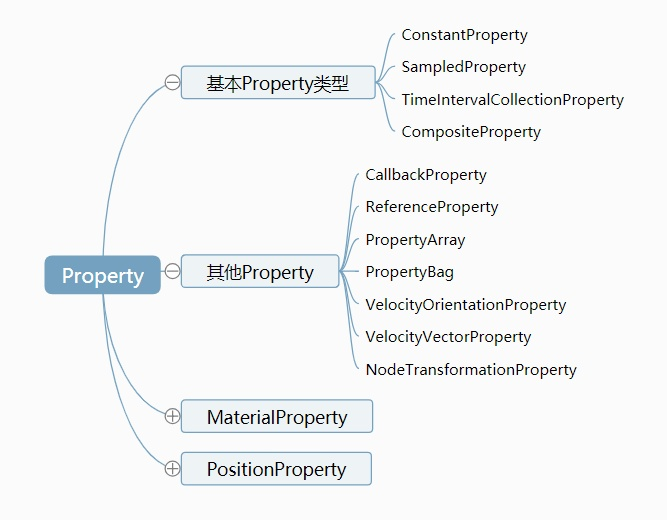

# Entity-API 与地球交互

[Entity](https://cesium.com/docs/cesiumjs-ref-doc/Entity.html)

## Option

属性：

| 名称           | 类型                                                         | 描述                                                 |
| :------------- | :----------------------------------------------------------- | :--------------------------------------------------- |
| `id`           | String                                                       | `可选`此对象的唯一标识符。如果未提供，则将生成GUID。 |
| `name`         | String                                                       | `可选`显示给用户的人类可读名称。它不必是唯一的。     |
| `availability` | [TimeIntervalCollection](https://cesium.com/docs/cesiumjs-ref-doc/TimeIntervalCollection.html) | `可选`与此对象关联的可用性（如果有）。               |
| `show`         | boolean                                                      | `可选`的布尔值，指示是否显示实体及其子级。           |
| `description`  | [Property](https://cesium.com/docs/cesiumjs-ref-doc/Property.html) | `可选`字符串属性，用于为此实体指定HTML描述。       |
| `position`     | [PositionProperty](https://cesium.com/docs/cesiumjs-ref-doc/PositionProperty.html) | `可选`一个指定实体位置的属性。                       |
| `orientation`  | [Property](https://cesium.com/docs/cesiumjs-ref-doc/Property.html) | `可选`一个指定实体方向的属性。                       |

可添加的Graphics 图案：

| option           | 类型                                                         | 描述                                 |
| ---------------- | ------------------------------------------------------------ | ------------------------------------ |
| `billboard`      | [BillboardGraphics](https://cesium.com/docs/cesiumjs-ref-doc/BillboardGraphics.html) | `可选`与此广告实体关联的广告牌。     |
| `box`            | [BoxGraphics](https://cesium.com/docs/cesiumjs-ref-doc/BoxGraphics.html) | `可选`与此实体关联的框。             |
| `corridor`       | [CorridorGraphics](https://cesium.com/docs/cesiumjs-ref-doc/CorridorGraphics.html) | `可选`与此实体关联的走廊。           |
| `cylinder`       | [CylinderGraphics](https://cesium.com/docs/cesiumjs-ref-doc/CylinderGraphics.html) | `可选`要与此实体关联的圆柱体。       |
| `ellipse`        | [EllipseGraphics](https://cesium.com/docs/cesiumjs-ref-doc/EllipseGraphics.html) | `可选`与此实体关联的椭圆。           |
| `ellipsoid`      | [EllipsoidGraphics](https://cesium.com/docs/cesiumjs-ref-doc/EllipsoidGraphics.html) | `可选`与此实体关联的椭球。           |
| `label`          | [LabelGraphics](https://cesium.com/docs/cesiumjs-ref-doc/LabelGraphics.html) | `可选`的options.label与此实体关联。  |
| `model`          | [ModelGraphics](https://cesium.com/docs/cesiumjs-ref-doc/ModelGraphics.html) | `可选`与该实体关联的模型。           |
| `path`           | [PathGraphics](https://cesium.com/docs/cesiumjs-ref-doc/PathGraphics.html) | `可选`与此实体关联的路径。           |
| `plane`          | [PlaneGraphics](https://cesium.com/docs/cesiumjs-ref-doc/PlaneGraphics.html) | `可选`与此实体关联的平面。           |
| `point`          | [PointGraphics](https://cesium.com/docs/cesiumjs-ref-doc/PointGraphics.html) | `可选`与此实体关联的点。             |
| `polygon`        | [PolygonGraphics](https://cesium.com/docs/cesiumjs-ref-doc/PolygonGraphics.html) | `可选`要与此实体关联的多边形。       |
| `polyline`       | [PolylineGraphics](https://cesium.com/docs/cesiumjs-ref-doc/PolylineGraphics.html) | `可选`与此实体关联的折线。           |
| `polylineVolume` | [PolylineVolumeGraphics](https://cesium.com/docs/cesiumjs-ref-doc/PolylineVolumeGraphics.html) | `可选`polylineVolume与此实体关联。 |
| `rectangle`      | [RectangleGraphics](https://cesium.com/docs/cesiumjs-ref-doc/RectangleGraphics.html) | `可选`要与此实体关联的矩形。         |
| `wall`           | [WallGraphics](https://cesium.com/docs/cesiumjs-ref-doc/WallGraphics.html) | `可选`与此实体关联的墙。             |

举例：

[官方例子 Points](https://sandcastle.cesium.com/?src=Points.html)

``` js
viewer.entities.add({
    position : Cesium.Cartesian3.fromDegrees(-75.59777, 40.03883),
    point : {
        pixelSize : 10,
        color : Cesium.Color.YELLOW
    }
});
```

上面示例中,使用了viewer的entities添加Entity实体，entities实际是entity的集合对象。其中：

- `id` : 表示唯一标识符
- `name` : 表示名字，可以不设置
- `position` : 点在场景中位置
- `point` : 指明该entity对象为point类型[PointGraphics](https://cesium.com/docs/cesiumjs-ref-doc/PointGraphics.html)，其中大小为10、颜色为黄色。

同样，添加面对象和多边形雷同，具体查询对应API文档。

``` js
        var videoElement = document.getElementById('trailer'); //获得video对象
        var sphere = viewer.entities.add({//添加实体
            name: 'video plane outline',
            position: Cesium.Cartesian3.fromDegrees(-79, 39, 0),
            plane: {//面对象
                plane: new Cesium.Plane(Cesium.Cartesian3.UNIT_Z, 0.0),
                dimensions: new Cesium.Cartesian2(400.0, 217.5),
                fill: true,
                outline: true,
                material: videoElement //指定材质
            },
            polygon: {//不规则多边形
                hierarchy: Cesium.Cartesian3.fromDegreesArray([
                    -79, 39,
                    -79.015, 39,
                    -79.02, 39.01,
                    -79, 39.01
                ]),
                material: videoElement //指定材质
            }
        });
```

查看[示例](https://sogrey.github.io/Cesium-start-Example//examples/video/Video-Fusion.html)

## 材质

空间对象可视化，不仅需要知道对象的空间位置，还需要知道对象的显示样式。显示样式就是通过材质来控制，比如说颜色、透明度、纹理贴图、更高级的光照等等。我们常用到就是颜色和透明度。

以下代码为绘制一个半透明的红色椭圆，设置material为Cesium.Color.RED.withAlpha(0.5)透明度为0.5的红色：

``` js
viewer.entities.add({
    position:Cesium.Cartesian3.fromDegrees(103.0, 40.0),
    name:'Red ellipse on surface with outline',
    ellipse:{
        semiMinorAxis:250000.0,
        semiMajorAxis:400000.0,
        material:Cesium.Color.RED.withAlpha(0.5),
    }
});
```

## 填充和边框

填充和边框共同组成了面状对象的样式，通过制定属性`fill`（默认为`true`）和`outline`（默认为`false`）来确定是否显示填充和边框，`material`对应填充样式，`outlineColor`和`outlineWidth`对应边框的颜色和宽度。如一下内容绘制一个填充半透明红色边框为蓝色的椭圆：

```js
viewer.entities.add({
    position:Cesium.Cartesian3.fromDegrees(103.0, 40.0),
    name:'Red ellipse on surface with outline',
    ellipse:{
        semiMinorAxis:300000.0,
        semiMajorAxis:300000.0,
        height:200000.0,
        fill:true,
        material:Cesium.Color.RED.withAlpha(0.5),
        outline:true, //必须设置height，否则ouline无法显示
        outlineColor:Cesium.Color.BLUE.withAlpha(0.5),
        outlineWidth:10.0//不能设置，固定为1
    }
});
```

## 贴图

通过设置material为图片url，可以将图片填充到对象中：

``` js
viewer.entities.add({
    position:Cesium.Cartesian3.fromDegrees(103.0, 40.0),
    name:'Red ellipse on surface with outline',
    ellipse:{
        semiMinorAxis:250000.0,
        semiMajorAxis:400000.0,
        height:200000.0,
        fill:true,
        material:"./sampledata/images/globe.jpg",
        outline:true, //必须设置height，否则ouline无法显示
        outlineColor:Cesium.Color.BLUE.withAlpha(0.5),
        outlineWidth:10.0//windows系统下不能设置固定为1
    }
});
```

## 垂直拉伸

有时候我们需要将面在垂直方向进行拉伸形成体，通过extrudedHeight即可实现这种效果，形成的体积任然符合它拉伸面的地球曲率。

``` js
viewer.entities.add({
    position:Cesium.Cartesian3.fromDegrees(103.0, 40.0),
    name:'Red ellipse on surface with outline',
    ellipse:{
        semiMinorAxis:250000.0,
        semiMajorAxis:400000.0,
        height:200000.0,
        extrudedHeight:400000.0,
        fill:true,
        material:Cesium.Color.RED.withAlpha(0.5),
        outline:true, //必须设置height，否则ouline无法显示
        outlineColor:Cesium.Color.BLUE.withAlpha(0.5),
        outlineWidth:10.0//windows系统下不能设置固定为1
    }
});
```

## 场景中entity管理

viewer.entities属性实际上是一个EntityCollecton对象，是entity的一个集合，提供了add、remove、removeAll等等接口来管理场景中的entity。

查看帮助文档，提供一下接口：


- [Cesium.EntityCollection.collectionChangedEventCallback(collection,added, removed, changed)](https://cesium.com/docs/cesiumjs-ref-doc/EntityCollection.html#.collectionChangedEventCallback) The signature of the event generated by [EntityCollection#collectionChanged](https://cesium.com/docs/cesiumjs-ref-doc/EntityCollection.html#collectionChanged).

- [add(entity) → Entity](https://cesium.com/docs/cesiumjs-ref-doc/EntityCollection.html#add) 添加实体

- [computeAvailability() → TimeInterval](https://cesium.com/docs/cesiumjs-ref-doc/EntityCollection.html#computeAvailability) 计算集合中实体的最大可用性。如果集合包含无限可用数据和非无限数据的混合，则它将返回仅与非无限数据有关的时间间隔。如果所有数据都是无限的，则将返回无限的间隔。

- [contains(entity) → Boolean](https://cesium.com/docs/cesiumjs-ref-doc/EntityCollection.html#contains) 是否有包含

- [getById(id) → Entity](https://cesium.com/docs/cesiumjs-ref-doc/EntityCollection.html#getById) 通过ID查询实体

- [getOrCreateEntity(id) → Entity](https://cesium.com/docs/cesiumjs-ref-doc/EntityCollection.html#getOrCreateEntity) 获取具有指定ID的实体或创建它，如果不存在，则将其添加到集合中。

- [remove(entity) → Boolean](https://cesium.com/docs/cesiumjs-ref-doc/EntityCollection.html#remove) 移除指定实体

- [removeAll()](https://cesium.com/docs/cesiumjs-ref-doc/EntityCollection.html#removeAll) 移除全部，清空

- [removeById(id) → Boolean](https://cesium.com/docs/cesiumjs-ref-doc/EntityCollection.html#removeById) 移除指定ID的实体

- [resumeEvents()](https://cesium.com/docs/cesiumjs-ref-doc/EntityCollection.html#resumeEvents) [EntityCollection#collectionChanged](https://cesium.com/docs/cesiumjs-ref-doc/EntityCollection.html#collectionChanged)添加或删除项目后立即 恢复引发事件。调用此函数时，在事件暂停期间进行的任何修改将作为单个事件触发。该函数是按引用计数的，只要有对的相应调用，就可以安全地多次调用[EntityCollection#resumeEvents](https://cesium.com/docs/cesiumjs-ref-doc/EntityCollection.html#resumeEvents)。

- [suspendEvents()](https://cesium.com/docs/cesiumjs-ref-doc/EntityCollection.html#suspendEvents) [EntityCollection#collectionChanged](https://cesium.com/docs/cesiumjs-ref-doc/EntityCollection.html#collectionChanged)在引发到的相应调用之前， 防止引发事件[EntityCollection#resumeEvents](https://cesium.com/docs/cesiumjs-ref-doc/EntityCollection.html#resumeEvents)，此时将引发涵盖所有已暂停操作的单个事件。这允许有效地添加和删除许多项目。只要有相应的调用，就可以安全地多次调用此函数[EntityCollection#resumeEvents](https://cesium.com/docs/cesiumjs-ref-doc/EntityCollection.html#resumeEvents)。

## DataSource

说到dataSourceDisplay，或许初学者会有点儿陌生。但是说到viewer.entities，可能大家都很熟悉了。实际上我们平常通过viewer.entities加入到场景中的各种对象，等同于加入到dataSourceDisplay当中。

dataSourceDisplay实际上内部管理着一堆dataSource对象，其中有一个比较特殊的dataSource，名字叫defaultDataSource。它的内部和其他类型的dataSource也很相似，都是由一堆entity组成的entities。entity代表一个实体。我们平时使用的viewer.entities，其实只是一个快捷方式。它真正调用的是`dataSourceDisplay.defaultDataSource.entities`。

我们通过viewer.entities增加到场景中的实体，实际上是由dataSourceDisplay来管理的。

defaultDataSource相当于Cesium为我们内置的一个dataSource，不需要我们手动创建，只需要调用viewer.entities直接加载三维实体就好。

### 参考

- [https://zhuanlan.zhihu.com/p/80904975](https://zhuanlan.zhihu.com/p/80904975)

## Scene

Scene是用来管理三维场景的各种对象实体的核心类.

globe用来表示整个地球的表皮，地球表皮的绘制需要两样东西，地形高程和影像数据。Cesium的地形高程数据只能有一套，而影像数据可以由多层，多层可以相互叠加。

primitives、groundprimitives则是表示加入三维场景中的各种三维对象了。groundPrimitives用来表示贴地的三维对象。我们之前通过viewer.entities加入场景中的三维实体，大多会转化成primitives和groundPrimitives。

这里面有一个值得注意的问题：经常有开发者会调用`scene.primitives.removeAll()`来清空所有三维场景对象。这个操作是破坏性的。因为viewer.entities可以自己管理和自身相关的primitive的，也就是它会自动调用scene.primitives的`add`和`remove`方法，来进行primitive的增删操作。然而此时因为`removeAll`的操作，却也被强制删掉了，从而导致viewer.entities失效。`removeAll`并非不能用，我们在接下来的Primitive类中论述。

最后剩下的就是一堆地球周边的环境对象了，比如`skyBox`（用来表示星空）、`skyAtmosphere`（用来表示大气）、`sun`（表示太阳）、`moon`（表示月亮）等等。

- [https://zhuanlan.zhihu.com/p/80904975](https://zhuanlan.zhihu.com/p/80904975)

## Cesium的Property机制



### 参考

- [Cesium的Property机制总结](https://zhuanlan.zhihu.com/p/50534090)
