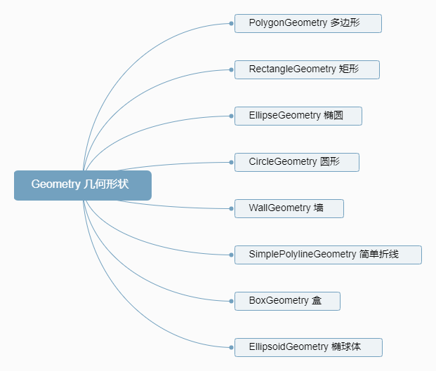
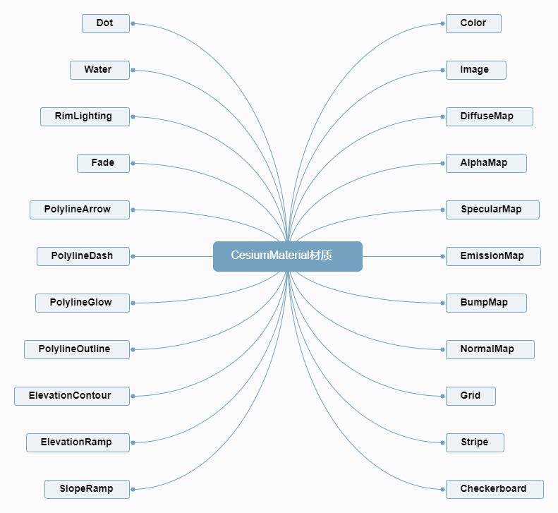

# Primitive-API 性能好，才是真的好

> Three.js中，要创建一个几何体(`THREE.Mesh`)，包括几何体(`THREE.Geometry`)还有材质(`THREE.Material`)才能正确渲染。
> 
> 在Cesium中，`Cesium.Primitive`包含两部分几何体`Cesium.Geometry`和外观`Cesium.Appearance`。

Primitive由两个部分组成：

- （1）几何形状（Geometry）：定义了Primitive的结构，例如三角形、线条、点等
- （2）外观（Appearance ）：定义Primitive的着色（Sharding），包括GLSL（OpenGL着色语言，OpenGL Shading Language）顶点着色器和片段着色器（ vertex and fragment shaders），以及渲染状态（render state）

使用Geometry和Appearance 具有以下优势：

- （1）性能：绘制大量Primitive时，可以将其合并为单个Geometry以减轻CPU负担、更好的使用GPU。合并Primitive由web worker线程执行，UI保持响应性
- （2）灵活性：Geometry与Appearance 解耦，两者可以分别进行修改
- （3）低级别访问：易于编写GLSL 顶点、片段着色器、使用自定义的渲染状态 

同时，具有以下劣势：

- （1）需要编写更多地代码
- （2）需要对图形编程有更多的理解，特别是OpenGL的知识

## Primitive 和 GroundPrimitive

图元（[`Primitive`](https://cesium.com/docs/cesiumjs-ref-doc/Primitive.html)）表示场景中的几何图形。几何可以来自不同的几何类型(`GeometryInstance`或`Geometry`)。图元将几何体实例与一个描述完整着色的外观（包括`Material`和`RenderState`）组合在一起。

大致而言，几何实例定义结构和位置，外观定义视觉特征。解耦几何形状和外观使我们能够混合和匹配其中的大多数，并彼此独立地添加新的几何形状或外观。将多个实例组合成一个原语称为批处理，可显着提高静态数据的性能。可以单独选择实例；`Scene＃pick`返回其`GeometryInstance＃id`。使用每个实例的外观（例如`PerInstanceColorAppearance`），每个实例也可以具有唯一的颜色。可以在Web Worker或主线程上创建并批处理几何。

官方Examples:
``` js
// 1. Draw a translucent ellipse on the surface with a checkerboard pattern
var instance = new Cesium.GeometryInstance({
  geometry : new Cesium.EllipseGeometry({
      center : Cesium.Cartesian3.fromDegrees(-100.0, 20.0),
      semiMinorAxis : 500000.0,
      semiMajorAxis : 1000000.0,
      rotation : Cesium.Math.PI_OVER_FOUR,
      vertexFormat : Cesium.VertexFormat.POSITION_AND_ST
  }),
  id : 'object returned when this instance is picked and to get/set per-instance attributes'
});
scene.primitives.add(new Cesium.Primitive({
  geometryInstances : instance,
  appearance : new Cesium.EllipsoidSurfaceAppearance({
    material : Cesium.Material.fromType('Checkerboard')
  })
}));
```
``` js
// 2. Draw different instances each with a unique color
var rectangleInstance = new Cesium.GeometryInstance({
  geometry : new Cesium.RectangleGeometry({
    rectangle : Cesium.Rectangle.fromDegrees(-140.0, 30.0, -100.0, 40.0),
    vertexFormat : Cesium.PerInstanceColorAppearance.VERTEX_FORMAT
  }),
  id : 'rectangle',
  attributes : {
    color : new Cesium.ColorGeometryInstanceAttribute(0.0, 1.0, 1.0, 0.5)
  }
});
var ellipsoidInstance = new Cesium.GeometryInstance({
  geometry : new Cesium.EllipsoidGeometry({
    radii : new Cesium.Cartesian3(500000.0, 500000.0, 1000000.0),
    vertexFormat : Cesium.VertexFormat.POSITION_AND_NORMAL
  }),
  modelMatrix : Cesium.Matrix4.multiplyByTranslation(
      Cesium.Transforms.eastNorthUpToFixedFrame(Cesium.Cartesian3.fromDegrees(-95.59777, 40.03883)),
      new Cesium.Cartesian3(0.0, 0.0, 500000.0), new Cesium.Matrix4()
  ),
  id : 'ellipsoid',
  attributes : {
    color : Cesium.ColorGeometryInstanceAttribute.fromColor(Cesium.Color.AQUA)
  }
});
scene.primitives.add(new Cesium.Primitive({
  geometryInstances : [rectangleInstance, ellipsoidInstance],
  appearance : new Cesium.PerInstanceColorAppearance()
}));
```
``` js
// 3. Create the geometry on the main thread.
scene.primitives.add(new Cesium.Primitive({
  geometryInstances : new Cesium.GeometryInstance({
      geometry : Cesium.EllipsoidGeometry.createGeometry(new Cesium.EllipsoidGeometry({
        radii : new Cesium.Cartesian3(500000.0, 500000.0, 1000000.0),
        vertexFormat : Cesium.VertexFormat.POSITION_AND_NORMAL
      })),
      modelMatrix : Cesium.Matrix4.multiplyByTranslation(
          Cesium.Transforms.eastNorthUpToFixedFrame(Cesium.Cartesian3.fromDegrees(-95.59777, 40.03883)),
          new Cesium.Cartesian3(0.0, 0.0, 500000.0), new Cesium.Matrix4()
      ),
      id : 'ellipsoid',
      attributes : {
        color : Cesium.ColorGeometryInstanceAttribute.fromColor(Cesium.Color.AQUA)
      }
  }),
  appearance : new Cesium.PerInstanceColorAppearance()
}));
```

地面图元([`GroundPrimitive`](https://cesium.com/docs/cesiumjs-ref-doc/GroundPrimitive.html))表示场景中叠加在地形或3D瓷砖上的几何图形。图元将几何体实例与一个描述完整着色的外观（包括`Material`和`RenderState`）组合在一起。

同样的，几何实例定义结构和位置，外观定义视觉特征。解耦几何形状和外观使我们能够混合和匹配其中的大多数，并彼此独立地添加新的几何形状或外观。要使用带有PerInstanceColorAppearance之外的其他PerInstanceColors或材质的GeometryInstances，需要支持WEBGL_depth_texture扩展。带纹理的GroundPrimitives是为概念性图案设计的，并不意味着将纹理精确地映射到地形，请使用SingleTileImageryProvider。为了正确渲染，此功能需要EXT_frag_depth WebGL扩展。对于不支持此扩展的硬件，某些视角会有渲染瑕疵。有效的几何图形包括`CircleGeometry`，`CorridorGeometry`，`EllipseGeometry`，`PolygonGeometry`和`RectangleGeometry`。

官方Examples:
``` js
// 1: Create primitive with a single instance
var rectangleInstance = new Cesium.GeometryInstance({
  geometry : new Cesium.RectangleGeometry({
    rectangle : Cesium.Rectangle.fromDegrees(-140.0, 30.0, -100.0, 40.0)
  }),
  id : 'rectangle',
  attributes : {
    color : new Cesium.ColorGeometryInstanceAttribute(0.0, 1.0, 1.0, 0.5)
  }
});
scene.primitives.add(new Cesium.GroundPrimitive({
  geometryInstances : rectangleInstance
}));
```
``` js
// 2: Batch instances
var color = new Cesium.ColorGeometryInstanceAttribute(0.0, 1.0, 1.0, 0.5); // Both instances must have the same color.
var rectangleInstance = new Cesium.GeometryInstance({
  geometry : new Cesium.RectangleGeometry({
    rectangle : Cesium.Rectangle.fromDegrees(-140.0, 30.0, -100.0, 40.0)
  }),
  id : 'rectangle',
  attributes : {
    color : color
  }
});
var ellipseInstance = new Cesium.GeometryInstance({
    geometry : new Cesium.EllipseGeometry({
        center : Cesium.Cartesian3.fromDegrees(-105.0, 40.0),
        semiMinorAxis : 300000.0,
        semiMajorAxis : 400000.0
    }),
    id : 'ellipse',
    attributes : {
        color : color
    }
});
scene.primitives.add(new Cesium.GroundPrimitive({
  geometryInstances : [rectangleInstance, ellipseInstance]
}));
```

## GeometryInstance 类
几何体实例化([`GeometryInstance`](https://cesium.com/docs/cesiumjs-ref-doc/GeometryInstance.html))允许将一个几何体对象放置在几个不同的位置并进行唯一着色。例如，可以对一个BoxGeometry进行多次实例化，每次使用不同的modelMatrix来更改其位置，旋转和比例。

官方Examples:
``` js
// Create geometry for a box, and two instances that refer to it.
// One instance positions the box on the bottom and colored aqua.
// The other instance positions the box on the top and color white.
var geometry = Cesium.BoxGeometry.fromDimensions({
  vertexFormat : Cesium.VertexFormat.POSITION_AND_NORMAL,
  dimensions : new Cesium.Cartesian3(1000000.0, 1000000.0, 500000.0)
});
var instanceBottom = new Cesium.GeometryInstance({
  geometry : geometry,
  modelMatrix : Cesium.Matrix4.multiplyByTranslation(
      Cesium.Transforms.eastNorthUpToFixedFrame(Cesium.Cartesian3.fromDegrees(-75.59777, 40.03883)),
      new Cesium.Cartesian3(0.0, 0.0, 1000000.0),
      new Cesium.Matrix4()
  ),
  attributes : {
    color : Cesium.ColorGeometryInstanceAttribute.fromColor(Cesium.Color.AQUA)
  },
  id : 'bottom'
});
var instanceTop = new Cesium.GeometryInstance({
  geometry : geometry,
  modelMatrix : Cesium.Matrix4.multiplyByTranslation(
      Cesium.Transforms.eastNorthUpToFixedFrame(Cesium.Cartesian3.fromDegrees(-75.59777, 40.03883)),
      new Cesium.Cartesian3(0.0, 0.0, 3000000.0),
      new Cesium.Matrix4()
  ),
  attributes : {
    color : Cesium.ColorGeometryInstanceAttribute.fromColor(Cesium.Color.AQUA)
  },
  id : 'top'
});
```
从上面代码看出，创建一个几何体(`BoxGeometry`)分别赋给不同的位置矩阵(`modelMatrix`)可实例化出多个几何实体
### GeometryInstanceAttribute 实例化几何属性信息
每个实例几何属性的值和类型信息([`GeometryInstanceAttribute`](https://cesium.com/docs/cesiumjs-ref-doc/GeometryInstanceAttribute.html))。相关的：
- [ColorGeometryInstanceAttribute](https://cesium.com/docs/cesiumjs-ref-doc/ColorGeometryInstanceAttribute.html) 每个实例几何图形颜色的值和类型信息。RGBA
- [ShowGeometryInstanceAttribute](https://cesium.com/docs/cesiumjs-ref-doc/ShowGeometryInstanceAttribute.html) 每个实例几何属性的值和类型信息，用于确定是否显示几何实例。
- [DistanceDisplayConditionGeometryInstanceAttribute](https://cesium.com/docs/cesiumjs-ref-doc/DistanceDisplayConditionGeometryInstanceAttribute.html) 每个实例几何属性的值和类型信息，用于确定几何实例是否具有距离显示条件。

官方Examples:
``` js
var instance = new Cesium.GeometryInstance({
  geometry : Cesium.BoxGeometry.fromDimensions({
    dimensions : new Cesium.Cartesian3(1000000.0, 1000000.0, 500000.0)
  }),
  modelMatrix : Cesium.Matrix4.multiplyByTranslation(Cesium.Transforms.eastNorthUpToFixedFrame(
    Cesium.Cartesian3.fromDegrees(0.0, 0.0)), new Cesium.Cartesian3(0.0, 0.0, 1000000.0), new Cesium.Matrix4()),
  id : 'box',
  attributes : {//几何属性的值和类型信息
    color : new Cesium.GeometryInstanceAttribute({
      componentDatatype : Cesium.ComponentDatatype.UNSIGNED_BYTE,
      componentsPerAttribute : 4,
      normalize : true,
      value : [255, 255, 0, 255]
    }),
    // color : new Cesium.ColorGeometryInstanceAttribute(red, green, blue, alpha),
    show : new Cesium.ShowGeometryInstanceAttribute(false),
    distanceDisplayCondition : new Cesium.DistanceDisplayConditionGeometryInstanceAttribute(100.0, 10000.0)
  }
});
```
## Geometry 类 几何形状

[Geometry doc](https://cesium.com/docs/cesiumjs-ref-doc/Geometry.html?classFilter=Geometry)

具有形成顶点的属性和定义图元的可选索引数据的几何图形表示。可以将描述阴影的几何图形和外观分配给图元以进行可视化。可以从许多不同的（在许多情况下）几何形状创建性能的基元。可以使用GeometryPipeline中的函数来转换和优化几何。

包含：
- [PolygonGeometry](https://cesium.com/docs/cesiumjs-ref-doc/PolygonGeometry.html) 多边形
- [RectangleGeometry](https://cesium.com/docs/cesiumjs-ref-doc/RectangleGeometry.html) 矩形
- [EllipseGeometry](https://cesium.com/docs/cesiumjs-ref-doc/EllipseGeometry.html) 椭圆
- [CircleGeometry](https://cesium.com/docs/cesiumjs-ref-doc/CircleGeometry.html) 圆形
- [WallGeometry](https://cesium.com/docs/cesiumjs-ref-doc/WallGeometry.html) 墙
- [SimplePolylineGeometry](https://cesium.com/docs/cesiumjs-ref-doc/SimplePolylineGeometry.html) 简单折线
- [BoxGeometry](https://cesium.com/docs/cesiumjs-ref-doc/BoxGeometry.html) 盒
- [EllipsoidGeometry](https://cesium.com/docs/cesiumjs-ref-doc/EllipsoidGeometry.html) 椭球体
- etc..



一般都有两种创建的方式：
- `*.createGeometry(*)`
- `*.fromDimensions(options)`

除了各种`Geometry`,基本上每种还对应有`*OutlineGeometry`,以原点为中心的几何体轮廓。

还有`*GeometryUpdater`,比如`BoxGeometry`对应就有`BoxGeometryUpdater`。客户端通常不直接创建此类，而是依赖于[`DataSourceDisplay`](https://cesium.com/docs/cesiumjs-ref-doc/DataSourceDisplay.html)。

## Material & MaterialProperty & MaterialAppearance 材质外观

### Material
[Material doc](https://cesium.com/docs/cesiumjs-ref-doc/Material.html?classFilter=Material)



### MaterialProperty
[MaterialProperty doc](https://cesium.com/docs/cesiumjs-ref-doc/MaterialProperty.html?classFilter=MaterialProperty)

相关：
- [CheckerboardMaterialProperty](https://cesium.com/docs/cesiumjs-ref-doc/CheckerboardMaterialProperty.html?classFilter=MaterialProperty)
- [ColorMaterialProperty](https://cesium.com/docs/cesiumjs-ref-doc/ColorMaterialProperty.html?classFilter=MaterialProperty)
- [CompositeMaterialProperty](https://cesium.com/docs/cesiumjs-ref-doc/CompositeMaterialProperty.html?classFilter=MaterialProperty)
- [GridMaterialProperty](https://cesium.com/docs/cesiumjs-ref-doc/GridMaterialProperty.html?classFilter=MaterialProperty)
- [ImageMaterialProperty](https://cesium.com/docs/cesiumjs-ref-doc/ImageMaterialProperty.html?classFilter=MaterialProperty)
- [PolylineArrowMaterialProperty](https://cesium.com/docs/cesiumjs-ref-doc/PolylineArrowMaterialProperty.html?classFilter=MaterialProperty)
- [PolylineDashMaterialProperty](https://cesium.com/docs/cesiumjs-ref-doc/PolylineDashMaterialProperty.html?classFilter=MaterialProperty)
- [PolylineGlowMaterialProperty](https://cesium.com/docs/cesiumjs-ref-doc/PolylineGlowMaterialProperty.html?classFilter=MaterialProperty)
- [PolylineOutlineMaterialProperty](https://cesium.com/docs/cesiumjs-ref-doc/PolylineOutlineMaterialProperty.html?classFilter=MaterialProperty)
- [StripeMaterialProperty](https://cesium.com/docs/cesiumjs-ref-doc/StripeMaterialProperty.html?classFilter=MaterialProperty)

``` js
//方法一，构造时赋材质
var entity = viewer.entities.add({
  position: Cesium.Cartesian3.fromDegrees(-103.0, 40.0),
  ellipse : {
    semiMinorAxis : 250000.0,
    semiMajorAxis : 400000.0,
    material : Cesium.Color.BLUE.withAlpha(0.5)//可设置不同的MaterialProperty
  }
});

//方法二，构造后赋材质
var ellipse = entity.ellipse;
ellipse.material = Cesium.Color.RED;
```

#### ColorMaterialProperty 颜色材质

是最常见的材质，纯色。

比如上面例子中：
``` js
ellipse.material = Cesium.Color.BLUE.withAlpha(0.5)//设置蓝色，透明度0.5
```

完整举例：
``` js
var entityColor = api.viewer.entities.add({
    position: Cesium.Cartesian3.fromDegrees(116.4, 40),
    ellipse: {
        semiMinorAxis: 2500.0,
        semiMajorAxis: 4000.0,
        material: Cesium.Color.BLUE.withAlpha(0.5) //可设置不同的MaterialProperty
    }
});
//也可以
//entityColor.ellipse.material = Cesium.Color.BLUE.withAlpha(0.5)
```

#### ImageMaterialProperty 图片材质

图片纹理功能比较丰富，主要有下面属性：

- `image` 值可以是URL，Canvas,或者Video
- `repeat` 值为一个二位数，分别表示X,y方向的重复次数，例如`new Cartesian2(2.0, 1.0)`表示x方向重复2次,y方向重复1次
- `color` 设置颜色之后，会在图片上覆盖一层设置的颜色
- `transparent` 是否透明，纹理为png图片的时候可以设置

举例：
``` js
var entityImage = api.viewer.entities.add({
    position: Cesium.Cartesian3.fromDegrees(116.3, 40),
    ellipse: {
        semiMinorAxis: 2500.0,
        semiMajorAxis: 4000.0,
        material: new Cesium.ImageMaterialProperty({
            image: '../../assets/img/arrow.png',
            color: Cesium.Color.BLUE,
            repeat: new Cesium.Cartesian2(4, 4)
        }),
    }
});
//也可以这么写
// entityImage.ellipse.material = new Cesium.ImageMaterialProperty({
//     image: '../../assets/img/arrow.png',
//     color: Cesium.Color.BLUE,
//     repeat : new Cesium.Cartesian2(4, 4)
// });
//也可以简单的写成
// entityImage.ellipse.material = '../../assets/img/arrow.png';
```
#### CheckerboardMaterialProperty 棋盘纹理
三个属性:

- `evenColor` 默认白色，棋盘的第一个颜色
- `oddColor` 默认黑色，第二个颜色
- `repeat` 重复次数

举例：
``` js
var entityCheckerboard = api.viewer.entities.add({
    position: Cesium.Cartesian3.fromDegrees(116.3, 40.05),
    ellipse: {
        semiMinorAxis: 2500.0,
        semiMajorAxis: 4000.0,
        material: new Cesium.CheckerboardMaterialProperty({
            evenColor: Cesium.Color.WHITE,
            oddColor: Cesium.Color.BLACK,
            repeat: new Cesium.Cartesian2(4, 4)
        }),
    }
});
//也可以
// entityCheckerboard.ellipse.material = new Cesium.CheckerboardMaterialProperty({
//     evenColor: Cesium.Color.WHITE,
//     oddColor: Cesium.Color.BLACK,
//     repeat: new Cesium.Cartesian2(4, 4)
// });
```
#### StripeMaterialProperty 条纹纹理
属性如下：

- `evenColor` 默认白色，棋盘的第一个颜色
- `oddColor` 默认黑色，第二个颜色
- `repeat` 条纹重复次数
- `offset` 偏移量
- `orientation` 水平或者垂直,默认水平

举例：
``` js
var entityStripe = api.viewer.entities.add({
    position: Cesium.Cartesian3.fromDegrees(116.4, 40.05),
    ellipse: {
        semiMinorAxis: 2500.0,
        semiMajorAxis: 4000.0,
        material: new Cesium.StripeMaterialProperty({
        evenColor : Cesium.Color.WHITE,
        oddColor : Cesium.Color.BLACK,
        repeat : 32,
        offset:20,
        orientation:Cesium.StripeOrientation.VERTICAL 
        }),
    }
});
//也可以
// entityStripe.ellipse.material = new Cesium.StripeMaterialProperty({
//   evenColor : Cesium.Color.WHITE,
//   oddColor : Cesium.Color.BLACK,
//   repeat : 32,
//   offset:20,
//   orientation:Cesium.StripeOrientation.VERTICAL 
// });
```
#### GridMaterialProperty 网格纹理
属性如下：

- `color` 网格颜色
- `cellAlpha` 单元格透明度
- `lineCount` 行列个数
- `lineThickness` 线粗细
- `lineOffset` 线偏移

举例：
```js
var entityGrid = api.viewer.entities.add({
    position: Cesium.Cartesian3.fromDegrees(116.5, 40.05),
    ellipse: {
        semiMinorAxis: 2500.0,
        semiMajorAxis: 4000.0,
        material: new Cesium.GridMaterialProperty({
            color : Cesium.Color.YELLOW,
            cellAlpha : 0.2,
            lineCount : new Cesium.Cartesian2(8, 8),
            lineThickness : new Cesium.Cartesian2(2.0, 2.0)
        }),
    }
});
//也可以
// entityGrid.ellipse.material = new Cesium.GridMaterialProperty({
//   color : Cesium.Color.YELLOW,
//   cellAlpha : 0.2,
//   lineCount : new Cesium.Cartesian2(8, 8),
//   lineThickness : new Cesium.Cartesian2(2.0, 2.0)
// });
```
#### PolylineGlowMaterialProperty
需要用到`Polyline`:
``` js
var entityPolyline = viewer.entities.add({
    polyline: {
        positions: Cesium.Cartesian3.fromDegreesArray([
            116.3, 39.95,
            116.5, 39.95
        ]),
        width: 20,
        material: Cesium.Color.RED
    }
});
var polyline = entityPolyline.polyline;
```
属性如下：

- `color` 发光的颜色(中心颜色为白色)
- `glowPower` 发光的长度，值为线宽的百分比(0~1.0)

举例：
``` js
polyline.material = new Cesium.PolylineGlowMaterialProperty({
    glowPower: 0.2,
    color: Cesium.Color.BLUE
});
```

#### PolylineGlowMaterialProperty
同样需要`Polyline`。

属性如下：

- `color` 线的颜色
- `outlineWidth` 线纹理宽度
- `outlineColor` 线纹理颜色

举例：
``` js
polyline.material = new Cesium.PolylineOutlineMaterialProperty({
    color : Cesium.Color.ORANGE,
    outlineWidth : 3,
    outlineColor : Cesium.Color.BLACK
});
```

[示例查看](https://sogrey.github.io/Cesium-start-Example/examples/material/MaterialProperty设置模型材质.html)
### MaterialAppearance
[MaterialAppearance doc](https://cesium.com/docs/cesiumjs-ref-doc/MaterialAppearance.html?classFilter=MaterialAppearance)

相关：
- [PolylineMaterialAppearance](https://cesium.com/docs/cesiumjs-ref-doc/PolylineMaterialAppearance.html?classFilter=MaterialAppearance)

[Fabric](https://github.com/AnalyticalGraphicsInc/cesium/wiki/Fabric) 见[下一节](11-Fabric.md)

有段大牛分享的代码：

``` js
/*
  流动纹理线
   color 颜色
   duration 持续时间 毫秒
*/
function PolylineTrailLinkMaterialProperty(color, duration) {
    this._definitionChanged = new Cesium.Event();
    this._color = undefined;
    this._colorSubscription = undefined;
    this.color = color;
    this.duration = duration;
    this._time = (new Date()).getTime();
}
Cesium.defineProperties(PolylineTrailLinkMaterialProperty.prototype, {
    isConstant: {
        get: function () {
            return false;
        }
    },
    definitionChanged: {
        get: function () {
            return this._definitionChanged;
        }
    },
    color: Cesium.createPropertyDescriptor('color')
});
PolylineTrailLinkMaterialProperty.prototype.getType = function (time) {
    return 'PolylineTrailLink';
}
PolylineTrailLinkMaterialProperty.prototype.getValue = function (time, result) {
    if (!Cesium.defined(result)) {
        result = {};
    }
    result.color = Cesium.Property.getValueOrClonedDefault(this._color, time, Cesium.Color.WHITE, result.color);
    result.image = Cesium.Material.PolylineTrailLinkImage;
    result.time = (((new Date()).getTime() - this._time) % this.duration) / this.duration;
    return result;
}
PolylineTrailLinkMaterialProperty.prototype.equals = function (other) {
    return this === other ||
        (other instanceof PolylineTrailLinkMaterialProperty &&
          Property.equals(this._color, other._color))
}
Cesium.PolylineTrailLinkMaterialProperty = PolylineTrailLinkMaterialProperty;
Cesium.Material.PolylineTrailLinkType = 'PolylineTrailLink';
Cesium.Material.PolylineTrailLinkImage = "./sampledata/images/colors.png";
Cesium.Material.PolylineTrailLinkSource = "czm_material czm_getMaterial(czm_materialInput materialInput)\n\
                                              {\n\
                                                   czm_material material = czm_getDefaultMaterial(materialInput);\n\
                                                   vec2 st = materialInput.st;\n\
                                                   vec4 colorImage = texture2D(image, vec2(fract(st.s - time), st.t));\n\
                                                   material.alpha = colorImage.a * color.a;\n\
                                                   material.diffuse = (colorImage.rgb+color.rgb)/2.0;\n\
                                                   return material;\n\
                                               }";
Cesium.Material._materialCache.addMaterial(Cesium.Material.PolylineTrailLinkType, {
    fabric: {
        type: Cesium.Material.PolylineTrailLinkType,
        uniforms: {
            color: new Cesium.Color(1.0, 0.0, 0.0, 0.5),
            image: Cesium.Material.PolylineTrailLinkImage,
            time: 0
        },
        source: Cesium.Material.PolylineTrailLinkSource
    },
    translucent: function (material) {
        return true;
    }
});
```

<details>
<summary>查看代码段</summary>
逗你呢
</details>

[github](https://github.com/YanzheZhang/Cesium.HPUZYZ.Demo/blob/master/Cesium1.43/MyDemos/Tools-34TrailLine.html)

1. 新建PolylineTrailLinkMaterialProperty纹理类
2. 通过Cesium.Material._materialCache.addMaterial接口添加到系统内置纹理缓存中。


## 参考

- [Cesium(三) 几何图形与外观](https://blog.csdn.net/happyduoduo1/article/details/51868042)
- [cesium编程入门(八)设置材质](https://www.jianshu.com/p/4697d8147926)


